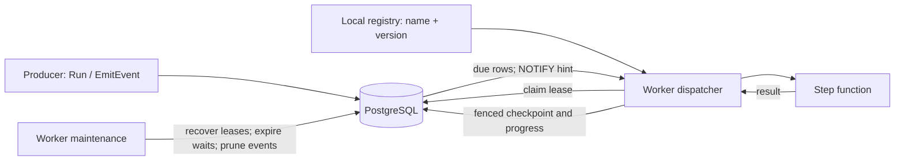

# Architecture

This is the implementation model for `durablepg`, not a second usage guide. Start with the [README](README.md) to define and run a workflow. The important distinction here is between **durable progress in PostgreSQL** and **user code that may run more than once**.

## Process and storage layout



There is no separate broker or coordinator: PostgreSQL coordinates worker ownership. An `Engine` holds a connection pool, a queue name, and compiled workflow definitions in its process. PostgreSQL holds runs and checkpoints. Every process that enqueues a workflow must register its definition locally; every worker must register the exact `(name, version)` pairs it intends to execute. Registration does not persist Go functions to the database.

| Source | Responsibility |
| --- | --- |
| [`builder.go`](builder.go) | Compile ordered operations and validate step names and versions. |
| [`engine.go`](engine.go) | Register definitions, enqueue runs, emit events, expose the engine lifecycle. |
| [`worker.go`](worker.go) | Claim and execute runs, fence writes, renew leases, recover interrupted work. |
| [`migrate.go`](migrate.go) | Apply schema migrations and maintain event-log partitions. |
| [`types.go`](types.go) | Configuration, enqueue options, and the context available to steps. |

## The run is a cursor, not a serialized program

A row in `workflow_runs` contains the workflow name and version, input JSON, queue, current `step_index`, state, due time, attempt counters, and lease fields. The worker finds the matching local definition and interprets the cursor against that definition's ordered operations. Changing the operations for an existing version can therefore change what a suspended run means. The database cannot detect that code change. Publish a new version and keep the old code available until its runs finish.

```mermaid
stateDiagram-v2
    [*] --> ready: Run inserted
    ready --> leased: Compatible worker claims due run
    leased --> ready: Error or expired lease; backoff
    leased --> ready: Sleep; future due time
    leased --> waiting_event: Register exact key and deadline
    waiting_event --> ready: Event or timeout
    leased --> completed: No operations remain
    leased --> failed: Failure limit reached
```



A `ready` row can have `next_run_at` in the future. `Sleep` stores the position *after* itself, clears the lease, and leaves the row `ready` until that time. Waiting for an event likewise stores the next position, so both delivery and timeout continue at the following operation. A timeout is not a successful event delivery.

### Checkpoint and replay

When a worker claims a run, it loads that run's step checkpoints. A checkpoint key includes the operation index and step name (for example, `0001:charge`). For each step:

1. If a checkpoint exists at the current cursor, use its JSON value and advance the cursor without calling the function. This also handles runs checkpointed by older engine versions before their cursor update.
2. Otherwise call the function and encode its result as JSON. A single lease-fenced PostgreSQL statement locks the run, records the first completed result, and advances `step_index` atomically. A conflicting checkpoint's stored value wins; an expired or replaced claim cannot write either progress or a result.

If the statement committed but its response was lost, recovery loads the checkpoint and resumes after it. A crash before commit can repeat the function. These guarantees cover workflow progress, not external effects.

The checkpoint cannot share a transaction with an arbitrary external effect:

```text
charge external API  →  process crashes  →  no checkpoint  →  charge step runs again
charge external API  →  checkpoint saved  →  process crashes  →  result is replayed
```

The first line is why step functions must be idempotent. `StepContext.IdempotencyKey()` is stable for the run and step across retries; the external system must actually honor it. Lease fencing protects this engine's PostgreSQL writes, not an already-issued HTTP request or other external work.

## Claim, lease, and recovery

The dispatcher looks for `ready` rows in its queue whose `next_run_at` is due and whose `(workflow_name, workflow_version)` is registered locally. It takes up to its available concurrency with `FOR UPDATE SKIP LOCKED`, then sets `state = 'leased'`, a unique token for each claim, and `lease_until`. Unsupported versions remain `ready` for a capable worker. A single supported definition has an equality-filtered claim path backed by a selective partial index; multi-definition workers use a paired name/version filter.

Each active claim has a heartbeat. By default it renews every 10 seconds against a 30-second lease. Step commits, cursor updates, sleep/event parking, retries, and completion all require the claim token and an unexpired lease. The heartbeat cancels its execution context when renewal fails definitively or the last confirmed deadline passes. These checks prevent a worker that has lost its lease from committing later workflow progress; they cannot interrupt user code that ignores its context.

Maintenance starts with recovery and then checks every five seconds, separately from dispatch and event retention. It uses indexable statement-time cutoffs and drains full batches of 1,024 expired leases or timed-out waits, up to eight batches or one second per pass. Lease expiry increments `lease_failures`, applies backoff, and eventually marks the run `failed` at its configured limit; progress resets consecutive lease failures. A returned step error instead increments `attempt`, with backoff `min(250 ms × 2^(attempt-1), 60 s)`. Both counters are persisted. After a large outage, bounded maintenance can leave a recovery backlog; monitor the oldest overdue row.

Worker cancellation stops new claims. Active claims keep their heartbeats during a bounded drain of `max(LeaseTTL, 5s)`. If a step still ignores cancellation, `StartWorker` can return before it exits. `WaitForIdle(ctx)` waits for those goroutines after `StartWorker` returns; call it before closing the pool if full quiescence matters. It can wait forever if user code never returns.

## Events and timers

`EmitEvent` inserts `(event_key, payload_json, created_at, expires_at)` into `event_log` and wakes matching runs in one transaction. The run must still be in `waiting_event` for that **current** key and have an unexpired waiter. The payload is retained as event history, not delivered as a `StepContext` value. Events emitted through the engine expire after 24 hours; a still-retained event can satisfy a later wait on the same key. One event can wake several runs sharing a key.

The waiter-registration race is handled on both sides:

1. Before parking, the worker checks whether a matching, unexpired event already exists.
2. If not, it takes a transaction-scoped PostgreSQL advisory lock keyed by schema and event key. `EmitEvent` takes the same lock **before** inserting the event or inspecting waiters.
3. The worker checks event existence again **after acquiring the lock**, in a fresh `READ COMMITTED` statement. If an event committed first, it advances the cursor; otherwise it atomically registers the waiter and parks the run before releasing the lock. If registration commits first, the emitter sees and wakes the waiter in its own transaction. Neither outcome relies on a post-commit Go callback surviving process exit.
4. A post-commit check remains for best-effort support of direct event-log writes that do not use `EmitEvent`'s lock. Direct SQL writers do not participate in the engine's durable wake protocol; use `EmitEvent` for reliable signal delivery. Timeout promotion atomically moves a due run to `ready` and removes its waiter.

`LISTEN/NOTIFY` wakes dispatch sooner after enqueue or event delivery. It is a hint: polling (250 ms by default) is the recovery path for missed notifications. With only one pool connection, the listener is disabled so it cannot monopolize that connection. The notification channel is shared across queues; a notification may wake a worker that finds no eligible work.

## Storage and migrations

| Table | Role |
| --- | --- |
| `workflow_runs` | Run state, input/output JSON, name/version, scheduling, lease token and deadlines, retry counters. |
| `step_checkpoints` | One saved JSON result per `(run_id, step_key)`; removed when its run is deleted. |
| `waiters` | `(event_key, run_id)` registrations and optional deadlines. |
| `event_log` | Events range-partitioned by `created_at` into UTC monthly tables plus a default partition. |
| `schema_migrations` | Ordered schema versions already applied. |

`ApplySchema` takes a transaction-scoped advisory lock per schema, applies missing migrations, and records each version in the same transaction. The current sequence is baseline tables (v1), waiting-deadline index (v2), workflow version and lease-failure columns plus partition-function refresh (v3), and a selective ready-claim index (v4). An installation without a ledger is treated as version 0; the baseline uses idempotent DDL so existing rows remain. `Init` calls `ApplySchema` and ensures the current event month plus the next 12.

Existing partitions are checked without exclusive locks. Creating a missing monthly range locks the event-log parent and default partition, moves matching default rows transactionally, then creates the range; this can pause event reads and writes for a large backfill. Create future months before traffic reaches them. A separate retention loop prunes expired event *rows* once a minute, in batches of 2,048 (up to 64 batches per pass). Workers do not automatically drop old partitions: `expires_at` is nullable for rows inserted directly with SQL, so age alone cannot prove a month is safe to delete.

The ready-run partial indexes cover queue/due-time scans and a selective `(queue, workflow_name, workflow_version, next_run_at, id)` path. A worker serving several definitions may still scan rows it cannot claim; inspect `EXPLAIN (ANALYZE, BUFFERS)` with your real queue mix before changing indexes or splitting queues.

## Operational signals and limits

These queries use the default schema; substitute your configured schema if different:

```sql
SELECT workflow_name, workflow_version, state, count(*)
FROM durable.workflow_runs
GROUP BY workflow_name, workflow_version, state;

SELECT id, workflow_name, workflow_version, next_run_at, attempt, lease_failures, last_error
FROM durable.workflow_runs
WHERE state = 'ready' AND next_run_at < now() - interval '5 minutes'
ORDER BY next_run_at LIMIT 50;

SELECT id, workflow_name, waiting_event_key, waiting_deadline
FROM durable.workflow_runs
WHERE state = 'waiting_event' AND waiting_deadline < now() - interval '1 minute'
ORDER BY waiting_deadline LIMIT 50;

SELECT id, workflow_name, lease_until, lease_owner, lease_failures
FROM durable.workflow_runs
WHERE state = 'leased' AND lease_until < now() - interval '1 minute'
ORDER BY lease_until LIMIT 50;
```

Worker claim, listener, and maintenance errors go to `Config.Logger` (by default `slog.Default()`). Also monitor failed runs, pool acquisition time, expired leases, overdue waits, and event-log growth. A listener holds one pool connection when enabled; steps and heartbeats also use the pool. Adding workers or reducing the poll interval increases PostgreSQL work and is not a substitute for measuring that pressure.

### Capacity and overload

Size execution slots for downstream calls, not just CPU. Each active claim has a heartbeat; at steady concurrency `C` and heartbeat interval `H`, expect approximately `C/H` lease-renewal statements per second in addition to claim, checkpoint, and completion work. The listener holds one pool connection when enabled. Monitor `pgxpool.Stat().AcquireDuration()`, `EmptyAcquireCount()`, and `AcquiredConns()` alongside lease expiries and the oldest due `ready` row. Reserve pool capacity for heartbeats and maintenance; a saturated pool can delay renewals until a valid claim expires. Keep polling enabled even if notification delivery normally appears immediate.

When arrival rate exceeds sustained completion rate, backlog is expected; raise concurrency only while pool waits, lease failures, and downstream error rates remain controlled. Split latency-sensitive and bulk work into existing queues with dedicated workers before adding priority scheduling. Maintenance catches up in bounded batches and may need multiple five-second passes after an outage; measure the oldest expired lease and waiting deadline, not only row counts. Run the PostgreSQL-backed one-step, ten-step, ten-step/large-result, and event benchmarks against a disposable database at representative concurrency and network latency. These benchmarks do not establish a production capacity guarantee.

`EmitEvent` wakes every matching waiter in one transaction. Shared broadcast keys can therefore produce large transactions and row-lock contention; use run-specific keys unless broadcast is intended. The event latency benchmark covers one waiter per emission, not high fan-out.

### Retention, upgrades, and recovery

Completed and failed `workflow_runs` and their `step_checkpoints` have no automatic TTL. Their run rows also hold the uniqueness record for `(workflow_name, idempotency_key)`. Deleting old runs cascades checkpoints and waiters and allows a previously used deduplication key to enqueue again; choose a deduplication retention horizon before purging terminal runs. Event rows emitted through the engine expire after 24 hours and are pruned; directly inserted events may have no expiration. Check a partition for live or nonexpiring events before detaching it. Precreate future partitions before traffic reaches the default partition.

Deploy new workflow versions alongside old workers; retire a version only after no `ready`, `leased`, or `waiting_event` runs reference it. Shutdown should stop claims, allow active work to drain, and call `WaitForIdle(ctx)` before closing shared dependencies if full quiescence matters. Database restore can rewind checkpoints and signal history relative to external effects: verify downstream idempotency keys remain valid for the restore window, reconcile affected external operations, and only then resume workers. A backup alone cannot provide exactly-once external effects.

In a disposable `pg_dump`/`pg_restore` drill, restoring a backup taken before a step ran executed the callback a second time with the **same** idempotency key. The engine cannot undo an external effect performed after the backup; the downstream system must deduplicate that key or operators must reconcile the effect before releasing restored work.

There is no administrative cancel/retry method. A state change cannot terminate an external call already running in user code. Do not reset a failed run or delete a leased run while a worker may still hold it; reconcile external effects, keep the original idempotency key, and determine a version-compatible recovery strategy first. Inspect `last_error`, `attempt`, `lease_failures`, `next_run_at`, and `waiting_event_key` to distinguish a business retry, expired lease, scheduled run, and event wait.


This engine does not store executable workflow history, infer compatibility between code versions, automatically compensate external effects, or guarantee exactly-once execution. It is suited to ordered, checkpointed Go work whose external effects can be made idempotent. Benchmarks and the command to reproduce them are in the [README](README.md#benchmarks).
