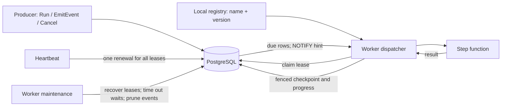
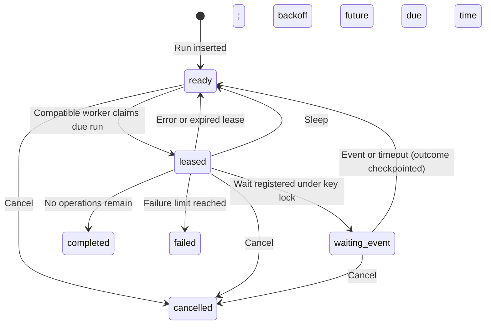

# Architecture

This is the implementation model for `durablepg`, not a second usage guide. Start with the [README](README.md) to define and run a workflow. The important distinction here is between **durable progress in PostgreSQL** and **user code that may run more than once**.

## Process and storage layout


```mermaid
flowchart LR
    P[Producer: Run / EmitEvent / Cancel] --> DB[(PostgreSQL)]
    R[Local registry: name + version] --> D[Worker dispatcher]
    DB -->|due rows; NOTIFY hint| D
    D -->|claim lease| DB
    D --> X[Step function]
    X -->|result| D
    D -->|fenced checkpoint and progress| DB
    H[Heartbeat] -->|one renewal for all leases| DB
    M[Worker maintenance] -->|recover leases; time out waits; prune events| DB
```

There is no separate broker or coordinator: PostgreSQL coordinates worker ownership. An `Engine` holds a connection pool, a queue name, and compiled workflow definitions in its process. PostgreSQL holds runs and checkpoints. Every process that enqueues a workflow must register its definition locally; every worker must register the exact `(name, version)` pairs it intends to execute. Registration does not persist Go functions to the database.

| Source | Responsibility |
| --- | --- |
| [`builder.go`](builder.go) | Compile ordered operations and validate step names and versions. |
| [`engine.go`](engine.go) | Register definitions, enqueue runs, emit events, status, output, cancel. |
| [`queries.go`](queries.go) | Every statement, rendered once per engine for its schema. |
| [`worker.go`](worker.go) | Claim and execute runs, fence writes, listen, recover interrupted work. |
| [`leases.go`](leases.go) | Per-worker lease table used by the batched heartbeat. |
| [`migrate.go`](migrate.go) | Apply schema migrations. |
| [`types.go`](types.go) | Configuration, enqueue options, run status, and the context available to steps. |

## The run is a cursor, not a serialized program

A row in `workflow_runs` contains the workflow name and version, input JSON, queue, current `step_index`, state, due time, attempt counters, and lease fields. The worker finds the matching local definition and interprets the cursor against that definition's ordered operations. Changing the operations for an existing version can therefore change what a suspended run means. The database cannot detect that code change. Publish a new version and keep the old code available until its runs finish.


```mermaid
stateDiagram-v2
    [*] --> ready: Run inserted
    ready --> leased: Compatible worker claims due run
    leased --> ready: Error or expired lease; backoff
    leased --> ready: Sleep; future due time
    leased --> waiting_event: Wait registered under key lock
    waiting_event --> ready: Event or timeout (outcome checkpointed)
    leased --> completed: No operations remain
    leased --> failed: Failure limit reached
    ready --> cancelled: Cancel
    leased --> cancelled: Cancel
    waiting_event --> cancelled: Cancel
```

A `ready` row can have `next_run_at` in the future. `Sleep` stores the position *after* itself, clears the lease, and leaves the row `ready` until that time. A waiting run instead keeps its cursor **on** the wait; delivery or timeout writes the wait's checkpoint, and the next claim replays it.

### Checkpoint and replay

The claim returns the run's checkpoints in the same statement (`jsonb_agg` in `RETURNING`), so starting a run costs one round trip. Checkpoints are keyed by `(run_id, step_index)`. For each operation from the cursor:

1. If a checkpoint exists at this position, use it and move on in memory without calling the function. It was written by an earlier claim, or by event delivery or timeout.
2. Otherwise call the function and encode its result as JSON. A single lease-fenced statement locks the run, records the first completed result, and advances `step_index` atomically. A conflicting checkpoint's stored value wins and is the only value sent back; an expired or replaced claim cannot write either progress or a result. When the step is the last operation, the same statement also completes the run, so a one-step workflow takes two statements: claim and commit.

The run's output is the result of its last step or wait. If the statement committed but its response was lost, recovery replays the checkpoint and resumes after it. A crash before commit can repeat the function. These guarantees cover workflow progress, not external effects.

The checkpoint cannot share a transaction with an arbitrary external effect:

```text
charge external API  →  process crashes  →  no checkpoint  →  charge step runs again
charge external API  →  checkpoint saved  →  process crashes  →  result is replayed
```

The first line is why step functions must be idempotent. `StepContext.IdempotencyKey()` is stable for the run and step across retries; the external system must actually honor it. Lease fencing protects this engine's PostgreSQL writes, not an already-issued HTTP request or other external work.

## Claim, lease, and recovery

The dispatcher looks for `ready` rows in its queue whose `next_run_at` is due and whose `(workflow_name, workflow_version)` is registered locally. It takes up to its available concurrency with `FOR UPDATE SKIP LOCKED`, then sets `state = 'leased'`, a unique token for each claim, and `lease_until`. Unsupported versions remain `ready` for a capable worker. A single supported definition has an equality-filtered claim path backed by a selective partial index; multi-definition workers use a paired name/version filter.

**One heartbeat per worker.** A single goroutine renews every active lease in one `UPDATE ... FROM unnest($ids, $tokens) RETURNING lease_token`, by default every 10 seconds against a 30-second lease. A token missing from the result was cancelled, recovered, or replaced, and its claim's context is canceled. If renewals fail, each claim's context is canceled when its last confirmed deadline passes. Step commits, cursor updates, sleep/event parking, retries, and completion all require the claim token and an unexpired lease. These checks prevent a worker that has lost its lease from committing later workflow progress; they cannot interrupt user code that ignores its context.

Maintenance starts with recovery and then checks every five seconds, separately from dispatch and event retention. It uses indexable statement-time cutoffs and drains full batches of 1,024 expired leases or timed-out waits, up to eight batches or one second per pass. Lease expiry increments `lease_failures`, applies backoff, and eventually marks the run `failed` at its configured limit; progress resets consecutive lease failures. A returned step error instead increments `attempt`, with backoff `min(250 ms × 2^(attempt-1), 60 s)`. Both counters are persisted. After a large outage, bounded maintenance can leave a recovery backlog; monitor the oldest overdue row.

Worker cancellation stops new claims. Active claims keep their heartbeats during a bounded drain of `max(LeaseTTL, 5s)`. If a step still ignores cancellation, `StartWorker` can return before it exits. `WaitForIdle(ctx)` waits for those goroutines after `StartWorker` returns; call it before closing the pool if full quiescence matters. It can wait forever if user code never returns.

## Events and timers

Delivery and timeout write the wait's checkpoint (`{"received": payload}` or `"timed_out"`) and make the run `ready`, so the step after a wait can tell a timeout from a delivery. Events emitted through the engine expire after 24 hours; a still-retained event satisfies a later wait on the same key with the most recent payload. One event can wake several runs sharing a key.

The registration race is closed by a transaction-scoped advisory lock on `(schema, key)`:

1. The worker locks the key, then looks for an unexpired event in a fresh statement. If one exists, it commits the received checkpoint and continues. Otherwise it parks the run as `waiting_event` with a deadline, inside the same transaction.
2. `EmitEvent` takes the same lock, then in one statement inserts the event, wakes matching runs whose deadline has not passed, writes their checkpoints, and notifies their queues.

Because each side's main statement starts after the lock, it sees whatever the other side committed first. Both transactions run at `READ COMMITTED` explicitly: under a `REPEATABLE READ` server default the snapshot would be taken before the lock was granted, and a run could park after the event committed. Neither side relies on a post-commit callback. Direct inserts into `event_log` bypass the lock and are not supported. Waiters live on `workflow_runs` (`waiting_event_key`, `waiting_deadline`); there is no separate waiter table to clean up. Timeouts are promoted by maintenance, so a timeout is observed up to five seconds late.

**Notifications.** The channel is `durablepg_<schema>`, with the queue as payload; workers ignore other queues, and engines on other schemas never wake each other. `pg_notify` runs inside the writing statement (enqueue, emit, timeout), so it fires only on commit and costs no extra round trip. The listener holds its own connection outside the pool. Notifications are hints: polling (250 ms by default) is the recovery path.

## Storage and migrations

| Table | Role |
| --- | --- |
| `workflow_runs` | State (CHECK-constrained), cursor, input/output JSON, name/version, scheduling, lease token and deadline, counters, wait key and deadline. IDs are UUIDv7. |
| `step_checkpoints` | One saved JSON result per `(run_id, step_index)`; removed when its run is deleted. |
| `event_log` | Events with `expires_at NOT NULL`; pruned in batches of 2,048 (up to 64 per pass) every minute. |
| `schema_migrations` | Ordered schema versions already applied. |

`ApplySchema` takes a transaction-scoped advisory lock per schema, applies missing migrations, and records each version in the same transaction. It refuses a schema migrated by a newer library (`ErrUnsupportedSchema`). This schema replaced the earlier one (text IDs, `"0001:name"` checkpoint keys, a `waiters` table, and a monthly-partitioned `event_log`); there is no in-place migration. The [Rust port](https://github.com/akashsharma95/durable-workflow-rs) uses the same tables, checkpoint formats, idempotency keys, lock keys, and notification channel. A scratch harness (not part of the test suite) ran a step–wait–step workflow both ways on one schema, Go producer with Rust worker and the reverse; each side read the other's checkpoints, delivered its events, and decoded its output. Both sides must register identical definitions under the same name and version.

The event log was partitioned monthly, with a PL/pgSQL function that moved rows under `ACCESS EXCLUSIVE` locks. With a 24-hour event TTL and batched deletes, a plain table is simpler and never takes that lock. If event volume makes row deletes too expensive, daily partitions dropped whole would be the next step.

The ready-run partial indexes cover queue/due-time scans and a selective `(queue, workflow_name, workflow_version, next_run_at, id)` path. A worker serving several definitions may still scan rows it cannot claim; inspect `EXPLAIN (ANALYZE, BUFFERS)` with your real queue mix before changing indexes or splitting queues.

## Operational signals and limits

These queries use the default schema; substitute your configured schema if different:

```sql
SELECT workflow_name, workflow_version, state, count(*)
FROM durable.workflow_runs
GROUP BY workflow_name, workflow_version, state;

SELECT id, workflow_name, workflow_version, next_run_at, attempt, lease_failures, last_error
FROM durable.workflow_runs
WHERE state = 'ready' AND next_run_at < now() - interval '5 minutes'
ORDER BY next_run_at LIMIT 50;

SELECT id, workflow_name, waiting_event_key, waiting_deadline
FROM durable.workflow_runs
WHERE state = 'waiting_event' AND waiting_deadline < now() - interval '1 minute'
ORDER BY waiting_deadline LIMIT 50;

SELECT id, workflow_name, lease_until, lease_failures
FROM durable.workflow_runs
WHERE state = 'leased' AND lease_until < now() - interval '1 minute'
ORDER BY lease_until LIMIT 50;
```

Worker claim, listener, and maintenance errors go to `Config.Logger` (by default `slog.Default()`). Also monitor failed runs, pool acquisition time, expired leases, overdue waits, and event-log growth. The listener holds one connection outside the pool; steps, the heartbeat, and maintenance share the pool. Adding workers or reducing the poll interval increases PostgreSQL work and is not a substitute for measuring that pressure.

### Capacity and overload

Size execution slots for downstream calls, not just CPU. Each worker issues one lease-renewal statement per heartbeat interval regardless of how many claims it holds. Monitor `pgxpool.Stat().AcquireDuration()`, `EmptyAcquireCount()`, and `AcquiredConns()` alongside lease expiries and the oldest due `ready` row. Reserve pool capacity for heartbeats and maintenance; a saturated pool can delay renewals until a valid claim expires. Keep polling enabled even if notification delivery normally appears immediate.

When arrival rate exceeds sustained completion rate, backlog is expected; raise concurrency only while pool waits, lease failures, and downstream error rates remain controlled. Split latency-sensitive and bulk work into existing queues with dedicated workers before adding priority scheduling. Maintenance catches up in bounded batches and may need multiple five-second passes after an outage; measure the oldest expired lease and waiting deadline, not only row counts. Run the PostgreSQL-backed one-step, ten-step, ten-step/large-result, and event benchmarks against a disposable database at representative concurrency and network latency. These benchmarks do not establish a production capacity guarantee.

`EmitEvent` wakes every matching waiter in one transaction. Shared broadcast keys can therefore produce large transactions and row-lock contention; use run-specific keys unless broadcast is intended. The event latency benchmark covers one waiter per emission, not high fan-out.

### Retention, upgrades, and recovery

Completed and failed `workflow_runs` and their `step_checkpoints` have no automatic TTL. Their run rows also hold the uniqueness record for `(workflow_name, dedup_key)`. Deleting old runs cascades checkpoints and allows a previously used deduplication key to enqueue again; choose a deduplication retention horizon before purging terminal runs. Event rows expire after 24 hours and are pruned.

Deploy new workflow versions alongside old workers; retire a version only after no `ready`, `leased`, or `waiting_event` runs reference it. Shutdown should stop claims, allow active work to drain, and call `WaitForIdle(ctx)` before closing shared dependencies if full quiescence matters. Database restore can rewind checkpoints and signal history relative to external effects: verify downstream idempotency keys remain valid for the restore window, reconcile affected external operations, and only then resume workers. A backup alone cannot provide exactly-once external effects.

In a disposable `pg_dump`/`pg_restore` drill, restoring a backup taken before a step ran executed the callback a second time with the **same** idempotency key. The engine cannot undo an external effect performed after the backup; the downstream system must deduplicate that key or operators must reconcile the effect before releasing restored work.

`Cancel` moves an unfinished run to `cancelled` and fences its worker; there is no retry method. Cancellation cannot terminate an external call already running in user code. Do not reset a failed run or delete a leased run while a worker may still hold it; reconcile external effects, keep the original idempotency key, and determine a version-compatible recovery strategy first. Inspect `last_error`, `attempt`, `lease_failures`, `next_run_at`, and `waiting_event_key` to distinguish a business retry, expired lease, scheduled run, and event wait.


This engine does not store executable workflow history, infer compatibility between code versions, automatically compensate external effects, or guarantee exactly-once execution. It is suited to ordered, checkpointed Go work whose external effects can be made idempotent. Benchmarks and the command to reproduce them are in the [README](README.md#benchmarks).
